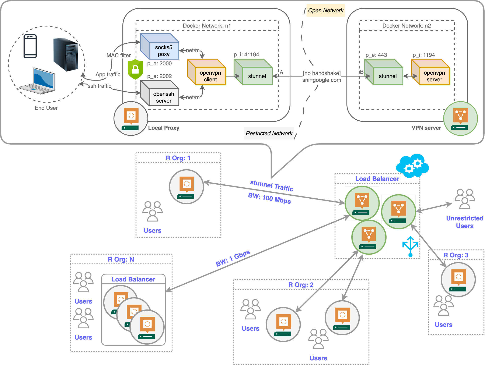

# Docker Stealth OpenVPN

<p align="center">
      <br><strong>Fig.1: Architecture</strong>
</p>

# Design

The repository implements a scalable non-blockable VPN service to enable unrestricted internet within an organisation that restricts network via firewalls. The Overall architecture is shown in Figure 1. The clients are oblivious to the interanl working process and only route traffic through the local socks5 proxy deployed within the organisation. The proxy host forward all packet via a stunnel to the open internet (VPN server). Moreover, the local openssh server allows outgoing ssh connections from the restricted network.

In terms of scalibility, each participating node (Proxy/Server) can be fairly replicated or placed behind a load-balancer to enhance the network capacity of the underline virtual network. Some possible replication scenarios in an multi-organisation setup are shown the in the above diagram.


# Assumptions

+ VPN server must allows inbound connection to port: `443`
+ Local Proxy must allows outbound connection to port: `443`, and inbound connection to ports: `2000` (socks5), `2002` (sshd)
+ End user must use appropiate proxy clients to connect to the local proxy server. Some tested clients are shown later.


# Installation

To deploy the server side docker instances in the VPN server (open internet) do the following steps:

### VPN Server setup

```bash
git clone https://github.com/prasenjit52282/docker-stealth-openvpn.git
sudo apt-get update
sudo apt-get install make
cd docker-stealth-openvpn
sudo make install_deps
sudo make deploy_server
```
Copy `tunnel/stunnel.key`, `tunnel/stunnel.pem`, and `USERNAME[sClient].ovpn` file contents from server to the local proxy.

### Proxy Server setup

```bash
git clone https://github.com/prasenjit52282/docker-stealth-openvpn.git
sudo apt-get update
sudo apt-get install make
cd docker-stealth-openvpn
sudo make install_deps
sudo make deploy_proxy
```
Before running above commands, update the `SERVER_IP` in `.env` file and paste `tunnel/stunnel.key`, `tunnel/stunnel.pem`, and `USERNAME[sClient].ovpn` file contents to the local proxy.

### Uninstallation
    VPN Server
    └── sudo make clean_server

    Local Proxy
    └── sudo make clean_proxy

# Proxy Clients
The system is compitable with a wide range of proxy clients that supports socks5 protocal. We tested on Android, Windows, iOS, and macOS. Some excellient proxy clients are shown in figure 2.

<p align="center">
      <br><strong>Fig.2: Proxy Clients</strong>
</p>

### Download Links
+ Android [`Proxy Client - No Root`](https://play.google.com/store/apps/details?id=com.cryptoproxy.proxyclient&hl=en_US&pli=1)
+ Windows [`v2rayN`](https://github.com/2dust/v2rayN/releases/tag/6.23)
+ IPhone [`Potatso`](https://apps.apple.com/us/app/potatso/id1239860606)
+ macOS [Wifi Setting > details > Proxies > SOCKS proxy](https://oxylabs.io/resources/integrations/mac)

The proxy servers (x.x.x.x) exposes the socks ports in 2000. Set server IP and server port in the client and ask the admin to register your MAC address as a valid client MAC. Now you can experience open internet again. Enjoy :) 

# Pending Features
+ MAC-based client filtering
+ Auto-scale with docker-swarm
+ Distributed client Management on multi-proxy setup

# Credits
+ [dweomer/stunnel](https://github.com/dweomer/dockerfiles-stunnel) is referred to create the stunnel between the Local Proxy and the VPN server
+ [wfg/docker-openvpn-client](https://github.com/wfg/docker-openvpn-client) is referred t create the vpn client at the local proxy
+ [Dr. Bishakh C. Ghosh](https://github.com/ghoshbishakh) has helped a lot developing the initial idea of this work


# Contact Me
This is a fun project to enable open internet in an restricted organisation. I hope it will help you to setup your own proxies within any monitored network. For questions and general feedback, contact [Prasenjit Karmakar](https://www.linkedin.com/in/prasenjit52282).